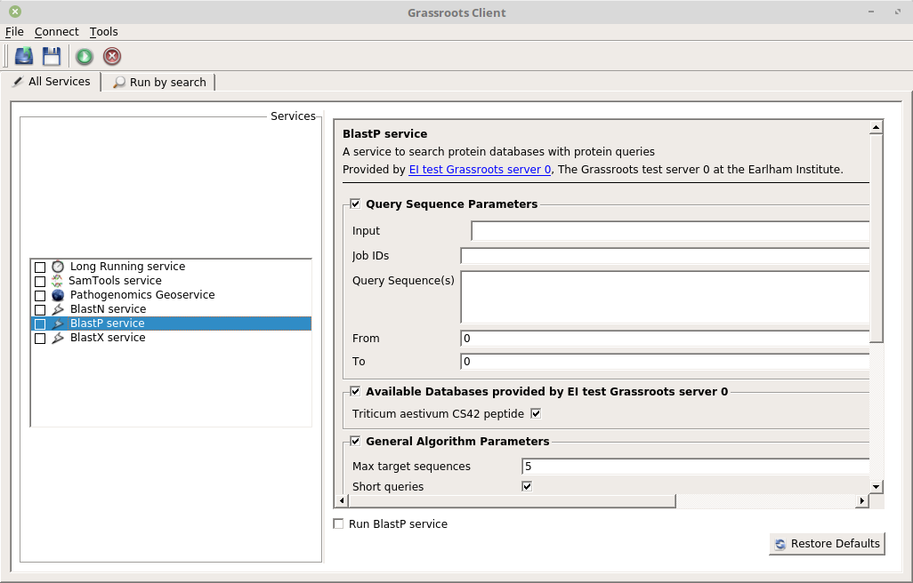

# Desktop client


This builds a  graphical user interface desktop client to access a Grassroots server allowing you to query and run services, view results, *etc.* It uses a [Qt](https://www.qt.io)-based GUI.



## Installation

To build this client, you need the [grassroots core](https://github.com/TGAC/grassroots-core) and [grassroots build config](https://github.com/TGAC/grassroots-build-config) installed and configured. You will also need the [Qt development](https://www.qt.io/download/) version 5.x or later files installed.

The files to build the desktop client are in the ```build/<platform>``` directory. 

### Linux

If you enter this directory 

```
cd build/linux
```

you can then create the makefile by typing

```
qmake -makefile grassroots-QT.pro
```

and then 

```
make 
```

to install the client into the Grassroots system.

## Usage

To run the client, the command is ```./grassroots-qt-client <options>```

The available options 

 * **h \<server_url\>**: The web address of the Grassroots server to connect to.
 * **--list-all**: Get all available services from the Grassroots server.
 * **--keyword-search \<keyword\>**: Perform a keyword search for a given value against all keyword-aware services.
 * **--list-interested \<resource\>**: Get all services that are able to run against a given resource. The resource is in the form \<protocol\>://\<name\> *e.g.* file:///home/test.fa, https://my.data/object, irods://data.fa, *etc.*
			
